# Ethereum Validator Analysis Dashboard

A comprehensive data pipeline for analyzing Ethereum validators, their deposit addresses, transaction histories, and smart contract deployment activities. Features automated data enrichment through multiple APIs and a beautiful Streamlit dashboard for interactive analysis.

## 🏗 Architecture Overview

```mermaid
graph TB
    subgraph "Data Sources"
        BC[🔗 BeaconChain API<br/>Validator Data]
        DA[📊 Dune Analytics API<br/>Transaction History]
        DEX[🏪 Dune DEX Query<br/>DEX Addresses]
    end
    
    subgraph "Processing Layer"
        PS[🐍 Python Pipeline<br/>validator_analysis.py]
    end
    
    subgraph "Storage Layer"
        PG[(🐘 Supabase<br/>PostgreSQL)]
        CSV[📄 CSV Export<br/>dune.csv]
    end
    
    subgraph "Presentation Layer"
        ST[🎨 Streamlit Dashboard<br/>Interactive Frontend]
    end
    
    BC --> PS
    DA --> PS
    DEX --> PS
    PS --> PG
    PS --> CSV
    PG --> ST
    
    classDef api fill:#e1f5fe,stroke:#01579b,stroke-width:2px
    classDef processing fill:#f3e5f5,stroke:#4a148c,stroke-width:2px
    classDef storage fill:#e8f5e8,stroke:#1b5e20,stroke-width:2px
    classDef frontend fill:#fff3e0,stroke:#e65100,stroke-width:2px
    
    class BC,DA,DEX api
    class PS processing
    class PG,CSV storage
    class ST frontend
```



## 🚀 Features

### Data Processing
- **Validator Enrichment**: Fetches deposit addresses for Ethereum validators using BeaconChain API
- **Transaction Analysis**: Analyzes transaction histories using Dune Analytics Sim API
- **Smart Contract Detection**: Automatically identifies addresses that have deployed smart contracts
- **DEX Address Identification**: Cross-references addresses with known DEX addresses from Dune Analytics
- **Batch Processing**: Handles large datasets efficiently with configurable batch sizes and rate limiting

### Interactive Dashboard
- **Real-time Filtering**: Filter validators by smart contract deployment status, DEX status, and date ranges
- **Interactive Visualizations**: Pie charts for distribution analysis and timeline charts for transaction activity
- **Data Export**: Download filtered results as CSV files
- **Auto-refresh**: Cached data with manual refresh capabilities
- **Responsive Design**: Modern, mobile-friendly interface

### Data Storage
- **Multiple Output Formats**: Saves data to both CSV files and Supabase database
- **Overwrite Mode**: Fresh data completely replaces existing records on each run
- **Secure Configuration**: Environment variable-based API key management

## 📊 Screenshots

*Dashboard Overview*
- Real-time metrics and filtering options
- Interactive charts showing validator distributions
- Transaction timeline analysis

## 🛠 Installation

### Prerequisites
- Python 3.8+
- Supabase account
- Dune Analytics API access

### Quick Start

1. **Clone the repository**
   ```bash
   git clone https://github.com/0xhaisenberg/eth-validator-analysis.git
   cd eth-validator-analysis
   ```

2. **Install dependencies**
   ```bash
   pip install -r requirements.txt
   ```

3. **Set up environment variables**
   
   Create a `.env` file in the project root:
   ```env
   # Dune API Keys
   DUNE_SIM_API_KEY=your_dune_sim_api_key_here
   DUNE_CLIENT_API_KEY=your_dune_client_api_key_here
   
   # Supabase Configuration
   SUPABASE_URL=https://your-project-id.supabase.co
   SUPABASE_KEY=your_supabase_anon_key_here
   SUPABASE_TABLE_NAME=validator_data
   
   # Optional Configuration
   BATCH_SIZE=100
   DELAY_SECONDS=15
   API_DELAY=0.25
   ```

4. **Set up Supabase database**
   
   Execute this SQL in your Supabase SQL Editor:
   ```sql
   -- Create the validator_data table
   CREATE TABLE validator_data (
       id BIGSERIAL PRIMARY KEY,
       index INTEGER,
       pubkey TEXT,
       deposit_address TEXT,
       last_transaction_time TIMESTAMPTZ,
       is_smart_contract BOOLEAN DEFAULT FALSE,
       is_dex BOOLEAN DEFAULT FALSE,
       created_at TIMESTAMPTZ DEFAULT NOW()
   );
   
   -- Create indexes for better query performance
   CREATE INDEX idx_deposit_address ON validator_data(deposit_address);
   CREATE INDEX idx_is_smart_contract ON validator_data(is_smart_contract);
   CREATE INDEX idx_is_dex ON validator_data(is_dex);
   CREATE INDEX idx_last_transaction_time ON validator_data(last_transaction_time);
   ```

5. **Run the data processing pipeline**
   ```bash
   python validator_analysis.py
   ```

6. **Launch the dashboard**
   ```bash
   streamlit run streamlit_app.py
   ```

## 📁 Project Structure

```
eth-validator-analysis/
├── validator_analysis.py      # Main data processing pipeline
├── streamlit_app.py          # Interactive dashboard
├── requirements.txt          # Python dependencies
├── .env                     # Environment variables (create this)
├── .env.example             # Example environment file
├── .gitignore              # Git ignore file
├── README.md               # This file
├── 0x00-validators.json    # Input validator data (JSON)
└── dune.csv               # Output CSV file
```

## 🔧 Configuration

### Environment Variables

| Variable | Required | Description | Default |
|----------|----------|-------------|---------|
| `DUNE_SIM_API_KEY` | Yes | Dune Analytics Sim API key | - |
| `DUNE_CLIENT_API_KEY` | Yes | Dune Analytics Client API key | - |
| `SUPABASE_URL` | Yes | Your Supabase project URL | - |
| `SUPABASE_KEY` | Yes | Your Supabase anon key | - |
| `SUPABASE_TABLE_NAME` | No | Database table name | `validator_data` |
| `BATCH_SIZE` | No | API batch processing size | `100` |
| `DELAY_SECONDS` | No | Delay between batches (seconds) | `15` |
| `API_DELAY` | No | Delay between API calls (seconds) | `0.25` |

### Input Data Format

The pipeline expects a JSON file (`0x00-validators.json`) with validator data:
```json
[
  {
    "index": 1,
    "pubkey": "0x123...",
    "status": "active"
  }
]
```

## 🚀 Usage

### Data Processing Pipeline

The main script processes validator data through several enrichment steps:

1. **Load Validators**: Reads validator data from JSON input file
2. **Fetch Deposit Addresses**: Uses BeaconChain API to get deposit addresses
3. **Analyze Transactions**: Uses Dune Sim API to analyze transaction history
4. **Detect Smart Contracts**: Identifies addresses that have deployed contracts
5. **Check DEX Addresses**: Cross-references with known DEX addresses
6. **Save Results**: Outputs to both CSV and Supabase database

### Dashboard Features

#### Filtering Options
- **Smart Contract Status**: Filter by contract deployment activity
- **DEX Status**: Filter by DEX address classification
- **Date Range**: Filter by last transaction date

#### Visualizations
- **Distribution Charts**: Pie charts showing validator categorization
- **Timeline Analysis**: Transaction activity over time
- **Metrics Dashboard**: Key statistics and counts

#### Data Export
- Export filtered results as CSV
- Real-time data refresh from Supabase
- Configurable column visibility

## 🔍 API Integrations

### BeaconChain API
- **Endpoint**: `https://beaconcha.in/api/v1/validator/{pubkeys}/deposits`
- **Purpose**: Fetches deposit addresses for validator public keys
- **Rate Limiting**: Built-in delays between batch requests

### Dune Analytics Sim API
- **Endpoint**: `https://api.sim.dune.com/v1/evm/transactions/{address}`
- **Purpose**: Analyzes transaction history and smart contract deployments
- **Features**: Transaction analysis, contract deployment detection

### Dune Analytics Client
- **Purpose**: Fetches known DEX addresses from curated query
- **Query ID**: 5644376 (ethereum-dex-addresses)

## 📈 Data Schema

### Validator Data Fields

| Field | Type | Description |
|-------|------|-------------|
| `id` | BIGSERIAL | Primary key (auto-generated) |
| `index` | INTEGER | Validator index |
| `pubkey` | TEXT | Validator public key |
| `deposit_address` | TEXT | Ethereum address used for staking deposit |
| `last_transaction_time` | TIMESTAMPTZ | Most recent transaction timestamp |
| `is_smart_contract` | BOOLEAN | Whether address deployed a smart contract |
| `is_dex` | BOOLEAN | Whether address is a known DEX address |
| `created_at` | TIMESTAMPTZ | Record creation timestamp |

## 🔒 Security

### Environment Variables
- All API keys stored in `.env` file (never committed to git)
- Environment variable validation on startup
- Secure Supabase connection with anon keys

### Best Practices
- Add `.env` to `.gitignore`
- Use read-only API keys where possible
- Rotate API keys regularly
- Use different environment files for different stages

## 🤝 Contributing

1. **Fork the repository**
2. **Create a feature branch**
   ```bash
   git checkout -b feature/amazing-feature
   ```
3. **Commit your changes**
   ```bash
   git commit -m 'Add some amazing feature'
   ```
4. **Push to the branch**
   ```bash
   git push origin feature/amazing-feature
   ```
5. **Open a Pull Request**

### Development Setup

```bash
# Install development dependencies
pip install -r requirements.txt

# Run tests
python -m pytest tests/

# Format code
black validator_analysis.py streamlit_app.py

# Lint code
flake8 validator_analysis.py streamlit_app.py
```

## 📝 License

This project is licensed under the MIT License - see the [LICENSE](LICENSE) file for details.

## 🙏 Acknowledgments

- [BeaconChain API](https://beaconcha.in/api/v1/docs) for validator data
- [Dune Analytics](https://dune.com) for transaction and DEX data
- [Supabase](https://supabase.com) for database services
- [Streamlit](https://streamlit.io) for the dashboard framework

## 📧 Support

If you have any questions or run into issues:

1. **Check the [Issues](https://github.com/0xhaisenberg/eth-validator-analysis/issues)** page
2. **Create a new issue** with detailed information
3. **Join the discussion** in existing issues

---

⭐ **Star this repo** if you find it useful!

Made with ❤️ by [0xhaisenberg](https://github.com/0xhaisenberg)